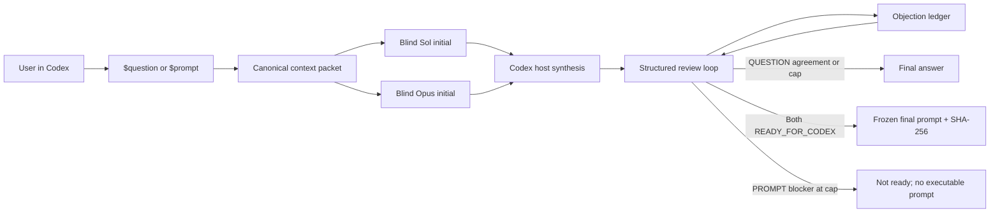

# Sol–Opus Council for Codex

[](https://github.com/Golden-Jie-LLC/sol-opus-council/actions/workflows/ci.yml)

Sol–Opus Council gives Codex two explicit, read-only deliberation workflows:

- `$question` returns a direct answer reviewed independently by GPT-5.6 Sol and
  Claude Opus.
- `$prompt` returns a frozen Codex execution prompt only after both peers sign
  off that no material execution blocker remains.

Codex is the only user interface. Claude Code runs headlessly in the background
as the Opus peer. There is no FAST mode and no third user workflow.

## Architecture



The Codex host gathers only relevant context, freezes and hashes it, then locks
its independent Sol position before Claude can answer. Claude receives the same
context version but never the Sol initial position. Subsequent reviews resume
one explicit Claude session UUID.

## QUESTION and PROMPT

### QUESTION

```text
$question 日本加息对日元、JGB和银行股的影响是什么？
```

`$question` returns a Sol + Opus reviewed answer. It uses at most three review
rounds and stops as soon as the current answer is sufficiently correct,
complete, and useful. Blind initial work, context repair, and mechanical retries
do not consume review rounds. If a material dispute remains after round 3, the
workflow still returns Codex's best synthesized answer and labels the unresolved
status honestly.

### PROMPT

```text
$prompt 给当前项目增加一个经过验证的 calendar event ingestion skill，生成可由 Codex 直接执行的完整任务说明。
```

`$prompt` returns a Codex execution prompt after at most ten review rounds. It
stops immediately when both Sol and Opus independently sign
`READY_FOR_CODEX` for the exact same candidate hash. It does not require them
to share every implementation preference. Alternative reasonable approaches,
wording preferences, style suggestions, and optional optimizations are
NON_BLOCKING.

`READY_FOR_CODEX` means the prompt can be handed to Codex without any known
material ambiguity, omission, contradiction, or defect reasonably likely to
cause an incorrect implementation. A BLOCKING issue threatens correctness,
intent or requirement preservation, feasibility, architecture consistency,
safety, regression risk, testability, or acceptance verification. An open
BLOCKING issue prevents the final prompt.

If a genuine blocker remains after round 10, PROMPT returns
`NO AGREEMENT — NOT READY FOR CODEX EXECUTION`, the blocker list, and the latest
draft artifact path. It does not present that draft as executable. On success,
it returns the exact signed `FINAL_CODEX_PROMPT` and SHA-256. It never executes
the prompt or modifies the business repository.

## Security and provider boundary

- Claude is invoked through the local Claude Code CLI with the current Claude
  subscription login. The runtime does not call the Anthropic API and does not
  require `ANTHROPIC_API_KEY`.
- The model is always `opus`. The adapter never passes a fallback model and
  fails explicitly if Opus is unavailable or resolved metadata names another
  model.
- Claude starts in safe mode with a strict empty MCP configuration, Chrome
  disabled, `dontAsk` permissions, and only `Read`, `Glob`, `Grep`,
  `WebSearch`, and `WebFetch` tools. There is no Bash, Write, Edit,
  NotebookEdit, mutation-capable MCP, browser control, daemon, or workspace
  write access.
- The council treats model output as review data. It never executes commands or
  patches produced by Claude.
- Council artifacts are outside the business repository by default, so a run
  does not pollute its Git status.

### Explicit invocation is provider authorization

Calling `$question` or `$prompt` is an explicit user action whose purpose is to
run the Sol–Opus council. That invocation therefore authorizes that one council
run to send the **minimum task-relevant context** to Anthropic Claude Opus via
the local Claude Code CLI. The skill must not ask for a second provider-consent
confirmation merely because Claude is a non-OpenAI model.

If a repository policy merely says that sending material to an external or
non-OpenAI model requires explicit user authorization, the explicit council
invocation satisfies that requirement. A genuinely stricter policy still wins:
if governing instructions explicitly forbid sending project material to
Anthropic/non-OpenAI/external providers even with user authorization, or mark
specific material as non-exportable, the council stops rather than transmitting
that material.

The invocation covers task-relevant user text, attachments, repository context,
evidence, and prior decisions. It does **not** implicitly authorize secrets, API
keys, credentials, `.env` contents, personal financial account or holdings data,
bulk raw private database contents, or unrelated private material. Those must
be excluded/redacted by default; if they are genuinely required, use a safer
sanitized alternative or handle that sensitive material separately and
explicitly.

Every canonical context packet records the authorization basis, provider,
scope, whether another provider confirmation is required, and the restricted
data boundary so the decision is auditable with the run artifacts.

## Requirements

- Windows, macOS, or Linux.
- Python 3.11 or newer.
- Codex CLI authenticated with the intended ChatGPT/Codex account.
- Claude Code CLI authenticated with a Claude subscription that can use Opus.
- Permission for Claude Code to persist local transcripts in its configured
  projects directory (normally `~/.claude/projects`), because review rounds
  resume the exact initial session UUID. In a sandboxed Codex run, grant only
  that directory—not the business repository—if prompted.
- The Codex host should be GPT-5.6 Sol. When the session exposes a different
  model identity, the skills stop instead of silently substituting a model.

Check the environment without exposing credentials:

```powershell
python scripts/doctor.py
```

If `claude` is not on `PATH`, set `CLAUDE_BIN` to its executable path for the
current shell, then rerun doctor. Doctor reports only versions, feature support,
and whether authentication is configured; it does not print credentials.

## Install

Repository-scoped installation into another repository:

```powershell
python scripts/install.py --scope repo --repo C:\path\to\target-repo
```

User-level installation:

```powershell
python scripts/install.py --scope user
```

This writes to `$CODEX_HOME/skills` (default `~/.codex/skills`), the user skill
root used by current Codex clients. Repository-scoped installs use
`<repo>/.agents/skills`.

Both commands install only `question`, `prompt`, and their private shared
runtime. They are idempotent. Codex detects skill changes automatically; if an
older client does not refresh the list, start a new Codex session.

Uninstall from the same scope:

```powershell
python scripts/uninstall.py --scope repo --repo C:\path\to\target-repo
python scripts/uninstall.py --scope user
```

The uninstaller removes only files recorded in this product's install manifest.

## Verified invocation and slash-menu behavior

The stable official invocations are:

```text
$question <question>
$prompt <task for which a Codex execution prompt should be generated>
```

In Codex CLI and the IDE extension, `/skills` opens the supported skill picker;
selecting QUESTION or PROMPT inserts the selected skill for the next request.
The desktop app also lists installed skills in its Skills UI. Skills are
explicit-only (`allow_implicit_invocation: false`), so ordinary questions never
start a council.

Current official Codex documentation does not define a stable per-skill literal
slash alias such as `/QUESTION`. This project therefore does not modify Codex or
pretend those aliases exist. Deprecated custom prompts and
`/prompts:question` shims are not required or installed.

## Artifacts, privacy, and cost

Each run is stored under:

```text
${CODEX_HOME:-$HOME/.codex}/council/runs/<timestamp>-<run-id>/
```

Artifacts include the versioned context packet and hashes, blind positions,
unique per-attempt prompt/stdout/stderr/parsed files, canonical and normalized
runtime schema snapshots/hashes with schema audit metadata, explicit session
metadata, candidate versions, structured reviews, ledger, status, manifest,
usage metadata when available, and the final answer or prompt. Credentials and
full environment dumps are never stored.

The relevant request, evidence, and permitted repository content are sent to
Claude through the local CLI. Claude subscription usage applies. The runtime
records provider-reported usage/cost metadata when present but does not guess a
cost when the CLI omits it.

Delete a run by removing its exact run directory after reviewing the path. Do
not delete the entire Codex home. The corresponding Claude session remains
subject to Claude Code's own local session-retention controls.

## Windows notes

The runtime uses `pathlib`, UTF-8, atomic file replacement, and subprocess
argument lists rather than shell command strings. Paths containing spaces are
supported. The adapter sends prompts over stdin and never relies on Bash.

## Troubleshooting

- **Claude not found:** set `CLAUDE_BIN` or install Claude Code, then run doctor.
- **Claude not logged in:** run the interactive `claude auth login` flow locally
  and rerun doctor. Never paste credentials or one-time codes into Codex chat.
- **Council asks for provider consent again:** when you explicitly invoked
  `$question` or `$prompt`, a policy that merely requires explicit user
  authorization is already satisfied. Re-check the installed skill version and
  governing instructions. A second confirmation should appear only for a
  genuinely stricter external-provider prohibition or restricted sensitive
  material.
- **Resume says “No conversation found”:** confirm the initial call could write
  its transcript to the configured Claude projects directory (normally
  `~/.claude/projects`). In a sandbox, grant that directory narrowly and restart
  the blind phase from a new canonical run; a returned UUID without a transcript
  cannot be repaired or replaced with `--continue`.
- **Opus unavailable:** stop. The council deliberately has no Sonnet/Haiku
  fallback.
- **Missing context:** supply only the material item listed by the run; at most
  two repairs are allowed, and each restarts the blind phase.
- **Malformed JSON or overload:** the adapter performs bounded mechanical
  retries with fresh output files. Such retries are not disagreement or review
  rounds.
- **PROMPT produced no final prompt:** inspect `no-agreement.json` and the latest
  candidate in the run directory. An open material blocker intentionally fails
  closed.

## Development

```powershell
$env:PYTHONPATH = "$PWD\src"
python -m unittest discover -s tests -v
python -m compileall -q src tests scripts
ruff check .
ruff format --check .
```

The deterministic suite uses a stub Claude executable; normal CI never requires
a real Claude or Codex login. An optional local live smoke should be run only
after deterministic tests pass and should stop at the first valid early-stop
result rather than spending the 3/10-round caps.

## Upstream and license

This repository is a fork and product migration of
[`octanevz/codex-debate`](https://github.com/octanevz/codex-debate). The full Git
history, original author attribution, and MIT License are preserved. See
[LICENSE](LICENSE).
